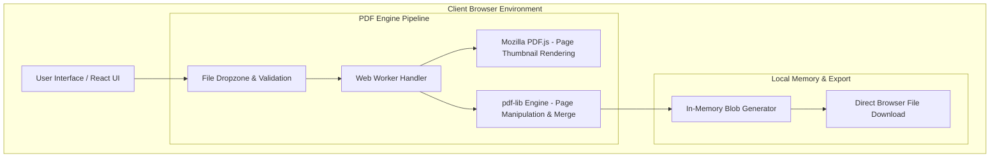

# System Architecture Specification - Kindpdf

**Project Name:** Kindpdf  
**Document Version:** 1.0.0  
**Last Updated:** 2026-08-02  

---

## 1. High-Level System Overview

Kindpdf operates as a **100% In-Browser Local-First Web Application** using Next.js 14 App Router, TypeScript, React, and Tailwind CSS. Document parsing and modification are handled by two core libraries:
- **`PDF.js` (Mozilla):** Used for rendering PDF page thumbnails, text layer extraction, and visual page previews inside the browser canvas.
- **`pdf-lib` (Hopding):** Used for low-level PDF manipulation, page merging, page splitting, rotation, and generating output PDF byte buffers.
- **Web Workers API:** Offloads heavy ArrayBuffer parsing and rendering computations off the main UI thread to prevent browser freezing during large file operations.



---

## 2. Privacy & Data Pipeline

```
[User Selects File] ──→ [File API Reads ArrayBuffer] ──→ [In-Browser Web Worker Processing] ──→ [Blob Download]
                                                                  │
                                                        (Zero Network Uploads)
```

1. **No External Endpoints:** Files selected by the user never leave the client's memory (`ArrayBuffer` / `Blob`).
2. **Memory Safety:** Object URLs created for previews (`URL.createObjectURL`) are revoked (`URL.revokeObjectURL`) immediately after rendering to prevent browser memory leaks.
3. **No File Persistence in LocalStorage:** Only user UI settings (e.g. theme preference) are stored in `localStorage`. Large document `File` objects are managed strictly in ephemeral React state / IndexedDB if needed.

---

## 3. Modular Directory Layout

```
02-local-pdf/
├── public/                # PDF.js worker static assets & manifest
├── src/
│   ├── app/               # Next.js 14 App Router (Layout & Tool Pages)
│   ├── components/        # UI Components & Primitives
│   │   ├── FileDropzone.tsx
│   │   ├── FileCard.tsx
│   │   ├── PageThumbnail.tsx
│   │   ├── ProcessingProgress.tsx
│   │   └── PrivacyNotice.tsx
│   ├── features/          # Tool Feature Modules
│   │   ├── merge/         # Merge PDF workspace & controls
│   │   ├── split/         # Split PDF workspace
│   │   ├── organize/      # Page organizing workspace
│   │   ├── extract/       # Extract pages workspace
│   │   └── image-to-pdf/  # Images to PDF converter workspace
│   ├── lib/
│   │   ├── pdf/           # pdf-lib wrappers (load, merge, split, extract, rotate)
│   │   ├── files/         # File validation & size formatters
│   │   └── errors/        # Human error messages
│   └── workers/           # Web Worker scripts for heavy PDF jobs
├── docs/                  # Project specifications & architecture docs
├── tasks/                 # Implementation plan & task backlog
├── tests/                 # Vitest unit test suites
├── README.md
└── package.json
```

---

## 4. Hardware Resource & Soft Limits

- **Max File Size:** 100 MB per file.
- **Max File Count:** 10 files per batch.
- **Max Page Count:** 500 pages per session.
- Hardware capability messaging: *"Processing speed depends on your device's available memory and CPU performance."*
